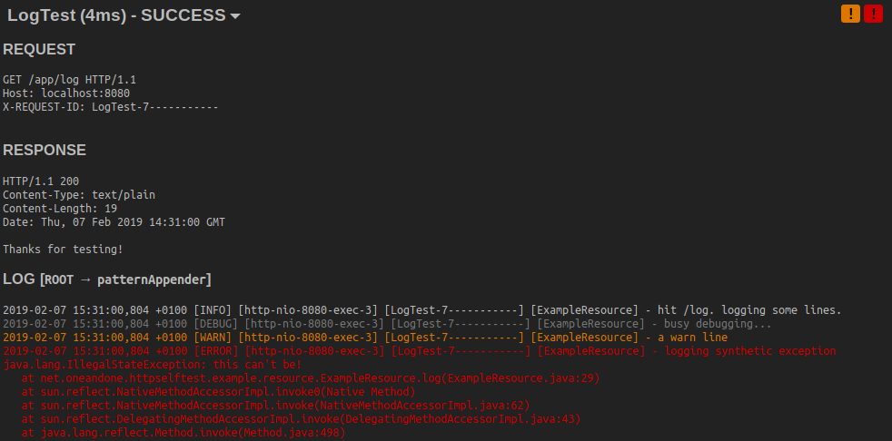

# HTTP Selftest
[](https://travis-ci.org/1and1/httpselftest)
[](https://github.com/1and1/httpselftest/releases/latest)
[](https://maven-badges.herokuapp.com/maven-central/net.oneandone.httpselftest/selftest-core)

This repo implements a base servlet and surrounding infrastructure to enable semi-automatic tests against a running application in any development stage. The tests are deployed with the application and run against itself. Test parameters can be pre-defined or provided by the user. This allows to have meaningful test parameters across multiple stages and environments.

The intended use is not clear-cut. The servlet can be used for e.g.
- basic integration tests,
- smoke tests before general release,
- incident response,
- definitive insight into interface behavior.

## Usage example
### Test run summary


### Single test output including request, response and log messages


### Test case implementation example
```java
public class MinimalSelftestServlet extends SelftestServlet {
    @Override
    protected TestConfigs getConfigs() {
        return new TestConfigs("param1");
    }
    public static class TestEcho implements TestCase {
        @Override
        public TestRequest prepareRequest(TestValues config, Context ctx) throws Exception {
            return new TestRequest("echo", "GET");
        }
        @Override
        public void verify(TestValues config, TestResponse response, Context ctx) throws Exception {
            Assertions.assertEqual("status code", 200, response.getStatus());
        }
    }
}
```

### Interactive example
You can easily play around with a simple test suite. Just launch the example app in the `spring-boot-example` module.

```bash
git clone https://github.com/1and1/httpselftest.git
cd httpselftest/selftest-springboot-example/
mvn spring-boot:run
# point your browser to the actuator endpoint: http://localhost:8081/actuator/selftest
# OR to the application port http://localhost:8080/selftest
```

## Integration
### GAV
```xml
<dependency>
   <groupId>net.oneandone.httpselftest</groupId>
   <artifactId>selftest-core</artifactId>
   <version>$VERSION</version>
</dependency>
```

### Dependencies
- Since HTTP Selftest is implemented as a Servlet, there is an implicit dependency on the javax Servlet API.
- HTML rendering is done using [j2html](https://j2html.com/). The dependency is co-packaged and shaded to avoid conflicts with production dependencies.
- JSON handling is done using [json-simple](https://cliftonlabs.github.io/json-simple/). The dependency is co-packaged and shaded to avoid conflicts with production dependencies.
- In case [Logback](https://logback.qos.ch/) logging support is used, logback dependencies need to be on the classpath (`logback-classic` and `logback-core`).

### Security
The servlet is not supposed to be exposed to the internet. This is an internal developer tool. Additionally, you may want to set `selftest.credentials`.

### Usage as Spring Boot 2 Actuator
If your application is a Spring Boot 2 app, the servlet can be registered as a `@ServletEndpoint`. In this case the application port and base path may need to be provided manually. The servlet will be running on the management port.

```java
@ServletEndpoint(id = "selftest")
public class SelftestEndpoint implements Supplier<EndpointServlet> {

    @Override
    public EndpointServlet get() {
        return new EndpointServlet(YourSelftestServlet.class)
            .withInitParameter(SelftestServlet.PROP_OVERRIDE_PORT, "8080")
            .withInitParameter(SelftestServlet.PROP_OVERRIDE_PATH, "/rest");
    }

}
```
### Usage as Spring Boot raw servlet
If your application is a Spring Boot app, the servlet can be registered by the way of `ServletRegistrationBean`. This way it will be running on the application port.

```java
@Bean
public ServletRegistrationBean<YourSelftestServlet> onProductionPort() {
    return new ServletRegistrationBean<>(new YourSelftestServlet(), "/selftest");
}
```

### Usage otherwise
If your application has a `web.xml`, the servlet containing your test cases can be registered there.
```xml
<servlet>
   <servlet-name>SelfTestServlet</servlet-name>
   <servlet-class>${SUBCLASS_OF_SelftestServlet}</servlet-class>
</servlet>
<servlet-mapping>
   <servlet-name>SelfTestServlet</servlet-name>
   <url-pattern>/selftest</url-pattern>
</servlet-mapping>
```

### Collecting request tracking IDs
If you want to collect log messages and your application is not already collecting request tracking IDs in the MDC, you can do so by registering a `SelftestMDCFilter`.

The filter can be registered in Spring Boot apps by the way of `FilterRegistrationBean`.

```java
@Bean
public FilterRegistrationBean selftestFilter() {
    FilterRegistrationBean filter = new FilterRegistrationBean();
    filter.setFilter(new SelftestMDCFilter());
    filter.addUrlPatterns("/*");
    filter.setName("selftestFilter");
    filter.setOrder(Ordered.HIGHEST_PRECEDENCE);
    return filter;
}
```

If you have a `web.xml` you can register it there.
```xml
<filter>
   <filter-name>SelftestMDCFilter</filter-name>
   <filter-class>net.oneandone.httpselftest.servlet.SelftestMDCFilter</filter-class>
</filter>
<filter-mapping>
   <filter-name>SelftestMDCFilter</filter-name>
   <url-pattern>/*</url-pattern>
</filter-mapping>
```

## Configuration
|  Servlet init parameter | Description | Default value |
|---|---| --- |
| `selftest.credentials` | Credentials for HTTP Basic authentication. Supports plain or SHA-256 (prefix with `plain\|` or `sha256\|`). | no authentication |
| `selftest.logger` | Logging framework to be used for log message extraction. Possible values: `[none, logback]` | `logback` |
| `selftest.configgroups` | Config groups can be used to filter out pre-defined configs that are irrelevant to the current environment. The values will be matched against the current hostname. Example: `"local, staging"`. Check the example application for usage. | no groups |
| `selftest.override.port` | Override for application port. Necessary if the httpselftest servlet runs on another port. | application port |
| `selftest.override.contextpath` | Override for application context path. Necessary if the httpselftest servlet runs on another port. | application path |
| `selftest.override.mdckey` | Override for MDC key storing the request tracking id. | `X-REQUEST-ID` |
